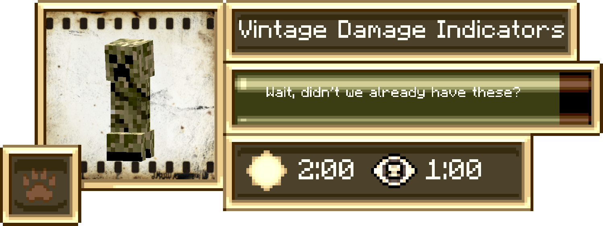
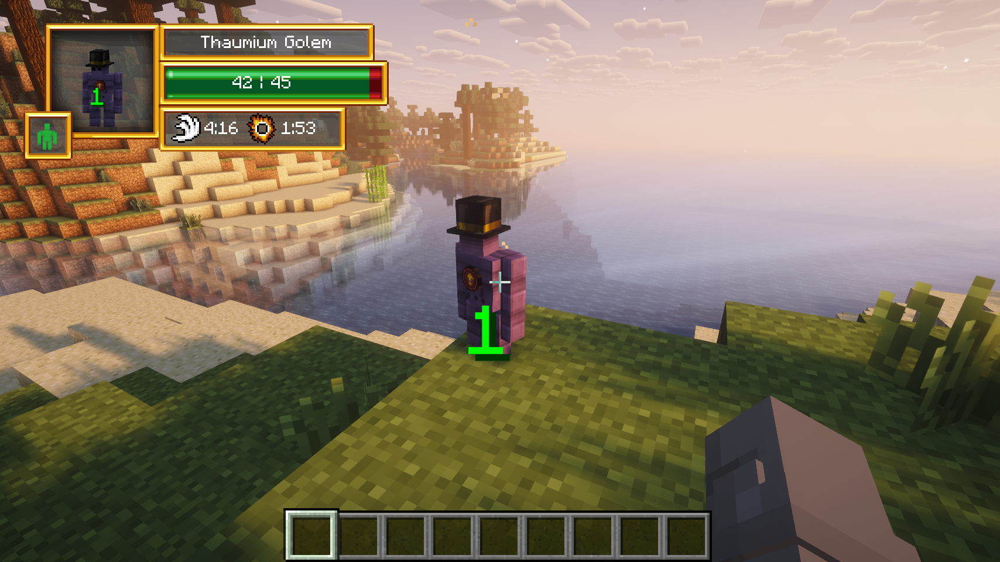
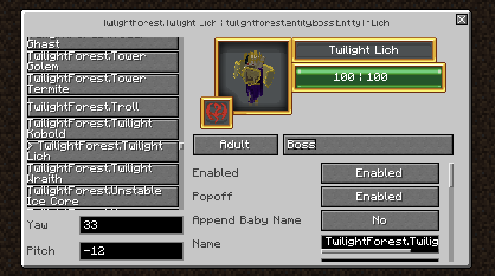

# Vintage Damage Indicators

Retro Damage Indicators backport with potion status support and damage particles.

<!--

-->

Most things are configurable.

## Dependencies
* [UniMixins](https://modrinth.com/mod/unimixins)   
* [ModularUI2](https://github.com/GTNewHorizons/ModularUI2) 

## Building

`./gradlew build`.

## Credits
* [Retro Damage Indicators](https://github.com/vladmarica/better-ping-display-fabric) (Licensed under [GPLv3](https://www.curseforge.com/minecraft/mc-mods/retro-damage-indicators#license))
* [GT:NH buildscript](https://github.com/GTNewHorizons/ExampleMod1.7.10)

## License

`LgplV3 + SNEED`.

## Buy me some creatine

* [ko-fi.com](https://ko-fi.com/jackisasubtlejoke)
* Monero: `893tQ56jWt7czBsqAGPq8J5BDnYVCg2tvKpvwTcMY1LS79iDabopdxoUzNLEZtRTH4ewAcKLJ4DM4V41fvrJGHgeKArxwmJ`

 

